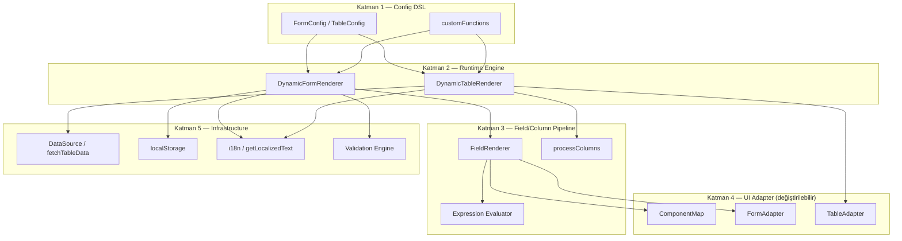
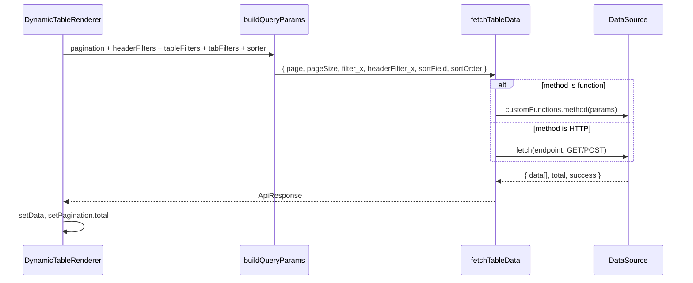

# `@solvpoint/dynamic-table-form-generators` — Yapısal Analiz (UI-Agnostic)

Bu paket, **declarative config (JSON/TS) → runtime renderer** desenine dayanan iki bağımsız ama paylaşımlı modülden oluşur. Mevcut implementasyon Ant Design üzerine kurulu; ancak mimari **UI kütüphanesinden ayrılabilir**. Aşağıdaki analiz, başka bir uygulamada (MUI, Shadcn, custom design system) yeniden kurmak için gereken yapısal katmanları tanımlar.

---

## 1. Paket Özeti ve Sorumluluk Sınırları

```
dynamic-table-form-generators/
├── src/
│   ├── form-generator/          # Form DSL + DynamicFormRenderer
│   │   ├── types.ts             # FormConfig, FieldConfig, ...
│   │   ├── utils.ts             # flatten, storage, expression, validation
│   │   ├── DynamicFormRenderer.tsx   # Orkestratör
│   │   ├── FieldRenderer.tsx         # Alan → widget çevirici
│   │   ├── PanelRenderer.tsx         # Accordion/card layout
│   │   └── TableRenderer.tsx         # Form içi nested tablo (CRUD modal)
│   ├── table-generator/         # Tablo DSL + DynamicTableRenderer
│   │   ├── types.ts
│   │   ├── utils.ts             # fetch, query build, column process
│   │   └── DynamicTableRenderer.tsx
│   ├── shared/
│   │   └── reactRenderGuards.ts # Güvenli bileşen çözümleme
│   └── locale/
│       └── format.ts            # Sayı/tarih biçimlendirme
└── index.ts                     # Public API
```

| Modül | Girdi | Çıktı | Temel sorumluluk |
|-------|-------|-------|------------------|
| **Form Generator** | `FormConfig` + `customFunctions` | Etkileşimli form UI | Alan render, validasyon, mode/permission, localStorage |
| **Table Generator** | `TableConfig` + `customFunctions` | Server-side tablo UI | Pagination, sort, filter, toolbar, Excel export |
| **Paylaşılan** | — | — | `FieldRenderer` (header filter), locale, render guards |

**Kritik tasarım kararı:** Config dosyaları (`*-form.ts`, `*-table.ts`) uygulama modülünde yaşar; paket yalnızca **motor + tip + yardımcılar** sağlar. Bu ayrım sayesinde aynı config'ler farklı UI kütüphanesiyle çalışabilir.

---

## 2. Mimari Katman Modeli (Ant Design'sız)

Başka uygulamada yeniden kurarken 5 katman yeterli:



**Ant Design'a bağlı olan tek katman:** Katman 4 (UI Adapter). Katman 1–3 ve 5 büyük ölçüde taşınabilir.

---

## 3. Form Generator — Derin Yapı

### 3.1 Config DSL (`FormConfig`)

Form, üç layout modundan birini destekler (öncelik sırasıyla):

1. **`panels[]`** — Accordion/card grupları (`PanelRenderer`)
2. **`tabs[]`** — Sekmeli form (`DynamicFormRenderer` içinde tab loop)
3. **`fields[]`** — Düz liste

```typescript
// UI-agnostic çekirdek tip (Ant tipleri çıkarılmış)
interface FormConfigCore {
  title?: string;
  layout?: 'horizontal' | 'vertical' | 'inline';
  size?: 'small' | 'middle' | 'large';
  fields?: FieldConfig[];
  panels?: PanelConfig[];
  tabs?: FormTabConfig[];
  localStorage?: LocalStorageConfig;
  buttonToolbar?: ButtonToolbarConfig;
}
```

### 3.2 Alan DSL (`FieldConfig`)

Her alan şu pipeline'dan geçer:

```
FieldConfig
  → visibility check (shouldRender / visibilityRules / conditionalRenders)
  → layout branch (FormList | Table | row | Divider | leaf)
  → componentMap[type] → Widget
  → FormFieldWrapper (label + rules + value binding)
```

**Desteklenen yapısal tipler** (layout/composite):

| `type` | Rol |
|--------|-----|
| `row` | Grid satırı; `fields[]` içinde `col/xs/sm/md/lg/xl` span |
| `FormList` | Tekrarlayan alan grubu; `itemFields[]` |
| `Table` | Form içi nested tablo + modal CRUD (`TableRenderer`) |
| `Divider` | Görsel ayraç |
| `Card`, `Tabs`, `Steps`, `Wizard` | Konteyner (şu an Ant wrapper) |

**Leaf widget tipleri:** `Input`, `Select`, `DatePicker`, `Upload`, `MaskedInput`, `RichTextEditor`, `CustomComponent`, vb.

### 3.3 Koşullu Mantık Motoru

Üç paralel mekanizma var; hepsi **string expression → `new Function('values', ...)`** ile çalışır:

| Mekanizma | Kullanım | Örnek |
|-----------|----------|-------|
| `shouldRender` + `dependencies` | Alan görünürlüğü | `'values.type === "Corporate"'` |
| `visibilityRules` | Aynı amaç, yeni API | `'values.country === "TR"'` |
| `conditionalRenders[]` | Operatör tabanlı | `{ field, operator: 'equals', value: 'X', action: 'show' }` |
| `enableRules` | Disabled/enabled | `'values.approvalRequired === true'` |
| Tab/panel `visible` | Sekme/panel gizleme | `'mode !== "create"'` (form mode inject edilir) |

**Taşınabilir alternatif:** `new Function` yerine güvenli expression parser (ör. `jsep` + whitelist) veya JSON Logic. Mevcut sistem esnek ama güvenlik açısından sandbox gerektirir.

### 3.4 Validasyon Pipeline

```
FieldConfig.rules[]           → senkron kurallar (required, min, max, pattern, email)
FieldConfig.dynamicValidations → cross-field / async
customFunctions.asyncValidators → { key: (rule, value) => Promise<void> }
applyAsyncValidators()        → rules[].asyncValidator string → fonksiyon eşlemesi
```

Submit akışı:

1. `form.validateFields()` (Ant) → **FormAdapter.validate()** olmalı
2. Hata varsa `groupErrorsByTab()` + `findFirstErrorTab()` → aktif sekmeyi değiştir
3. Başarılıysa `formatFormValues()` (dayjs → ISO string)

### 3.5 State ve Mode Makinesi

```typescript
type FormMode = 'view' | 'create' | 'update' | 'approval' | 'draft';

interface FormPermissions {
  view?: boolean;
  create?: boolean;
  update?: boolean;
  delete?: boolean;
  approve?: boolean;
  reject?: boolean;
  customButtons?: CustomButton[];
}
```

| Mode | Form davranışı | Toolbar butonları |
|------|----------------|-------------------|
| `view` | Tüm alanlar disabled | Yok (CRUD kapalı) |
| `create` | Düzenlenebilir | Ekle |
| `update` | Düzenlenebilir | Güncelle, Sil |
| `approval` | Düzenlenebilir/değil | Onayla, Reddet |

**Internal state** (`DynamicFormRenderer`):

- `activeTab`, `tabErrors` — sekme hata göstergesi
- `formValues` — koşullu tab visibility için
- `apiOptions` — cascade select cache
- `loading` — buton bazlı loading map
- `hasRestoredFromStorageRef` — localStorage tek seferlik restore

### 3.6 Bağımlı Alan Sistemi

İki desen:

```typescript
// 1. API tabanlı cascade
optionsFromApi: { endpoint: 'getDistricts', dependsOn: 'city' }
// customFunctions.apiCall(endpoint, dependencyValue)

// 2. Lokal cascade
optionsFromField: { dependsOn: 'country', getOptionsKey: 'getCities' }
// customFunctions.getCities(countryValue)
```

Değişim dinleyicisi: `onValuesChange` → bağımlı alanı bul → API çağır → child alanı sıfırla.

### 3.7 Form İçi Nested Tablo (`TableRenderer`)

Form alanı olarak `type: 'Table'` — form state'inde `name` key'i altında `[]` tutar:

```
form.values.addresses = [{ id, country, city, ... }, ...]
```

Modal içinde ayrı mini-form (`tableForm`) + `FieldRenderer` tekrar kullanımı. Bu, **form generator'ın kendi kendine compose edilebilir** olduğunu gösterir.

### 3.8 localStorage Stratejisi

| Anahtar deseni | Ne saklanır |
|----------------|-------------|
| `form_{key}_{mode}` | Form değerleri (mode-based) |
| `{formName}` (legacy) | Eski tek anahtar |

Restore kuralı: `mode === view|update` + `initialValues` doluysa **localStorage ezilmez**.

---

## 4. Table Generator — Derin Yapı

### 4.1 Config DSL (`TableConfig`)

```typescript
interface TableConfigCore {
  title: string;
  hideTitleBar?: boolean;
  api: ApiConfig;
  columns: ColumnConfig[];
  headerFilter?: HeaderFilterConfig;
  tabs?: TableTabConfig[];        // Statik filtre enjeksiyonu
  pagination?: PaginationConfig;
  localStorage?: { enabled, key, persistFilters };
  rowKey?: string;                // default: 'id'
}
```

### 4.2 Veri Akışı (Server-Side)



**Standart response sözleşmesi:**

```typescript
interface ApiResponse {
  data: any[];
  total: number;
  success: boolean;
  message?: string;
}
```

Dexie/local data layer kullanımında `api.method` doğrudan async fonksiyon olur — HTTP katmanı atlanır.

### 4.3 Filtre Birleştirme

Üç kaynak birleştirilir (öncelik: hepsi AND):

```typescript
combinedFilters = {
  ...activeTabConfig.filters,   // Tab: { status: 'Active' }
  ...tableFilters,              // Kolon header filter dropdown
  ...headerFilters,             // Üst panel collapse filter
}
```

Header filter **form-generator'ın `FieldRenderer`'ını yeniden kullanır** — bu iki modül arasındaki en güçlü coupling noktası.

### 4.4 Kolon Pipeline (`processColumns`)

```
ColumnConfig
  → title localization
  → render: string | function | customFunctions[key]
  → filter: { type, props, options } → filterDropdown UI
  → sorter: boolean | compare fn
```

Render string'leri `new Function('text','record','index','customFunctions', body)` ile derlenir. **Taşınabilir alternatif:** sadece fonksiyon referansı kabul et (type-safe).

### 4.5 Pagination / Sort State Makinesi

Internal state:

- `pagination: { current, pageSize, total }`
- `tableSorter: { field, order: 'ascend'|'descend'|null }`
- `tableFilters`, `headerFilters`
- `activeTab`

**Önemli edge case:** `handleTableChange` içinde pagination değişmediyse filter/sorter güncellenir; pagination değiştiyse mevcut filter state korunur (double-fetch bug önleme).

### 4.6 Toolbar ve Permissions

```typescript
interface TablePermissions {
  new?, edit?, delete?, view?, export?, import?, ...
}
interface TableButtons {
  new?, export?, edit?, ..., customButtons?
}
```

Buton görünürlüğü: `permissions.xxx !== false` (new/export) veya `permissions.xxx === true` (standart toolbar). Handler zinciri: `buttons.xxx.onClick` → `onXxxClick` prop → default (export için Excel).

**Ref API:** `DynamicTableRendererRef.exportToExcel()` — imperative handle.

### 4.7 Excel Export

`xlsx` paketi ile client-side export. Kolon `dataIndex` + `render` sonucu sheet'e yazılır. Bu katman UI'dan bağımsız.

---

## 5. Extension Modeli (`customFunctions`)

Her iki modülde de aynı desen:

```typescript
interface CustomFunctionsRegistry {
  [key: string]: any;

  // Form
  apiCall?: (endpoint, params) => Promise<options[]>;
  asyncValidators?: Record<string, AsyncValidatorFn>;
  normFile?: (e) => fileList;
  onFieldChange?: (fieldName, value, allValues, form) => void;

  // Table
  transformResponse?: (raw) => ApiResponse;
  onView?, onEdit?, onDelete?: (record) => void;
  [renderKey: string]: (text, record, index, ctx?) => ReactNode;
}
```

**CustomComponent** alanları: `component: MyWidget | 'myWidgetKey'` → `resolveCustomFieldComponent()` ile çözülür.

Bu registry, uygulama modülünde (`*-form.ts` / container) tanımlanır; config JSON'unda string referans olarak kullanılır.

---

## 6. Ant Design Bağımlılık Haritası (Ne Değiştirilmeli)

| Mevcut (Ant) | UI-Agnostic Soyutlama |
|--------------|----------------------|
| `Form.useForm()` | `FormAdapter`: `{ getValues, setValues, validate, reset, watch, setField }` |
| `Form.Item` | `FieldWrapper`: label + error + value/onChange |
| `Form.List` | `RepeaterField`: add/remove items |
| `Form.useWatch` | Adapter watch veya React context |
| `Tabs` | `TabContainer` interface |
| `Collapse` / `Card` | `PanelContainer` interface |
| `Table` | `DataGrid` interface: columns, dataSource, pagination, onChange |
| `Button`, `Space`, `Row/Col` | Layout primitives (CSS Grid / Flexbox) |
| `Modal.confirm` | `ConfirmDialog` adapter |
| `App.useApp().message` | `Toast/Notification` adapter |
| `dayjs` (DatePicker) | `DateValue` abstraction (Date / Temporal / dayjs) |

**Minimum adapter interface örneği:**

```typescript
// packages/ui-core/adapters/form-adapter.ts
interface FormAdapterInstance {
  getFieldsValue(deep?: boolean): Record<string, unknown>;
  setFieldsValue(values: Record<string, unknown>): void;
  setFieldValue(name: string | string[], value: unknown): void;
  getFieldValue(name: string | string[]): unknown;
  validateFields(): Promise<Record<string, unknown>>;
  resetFields(): void;
}

interface FormAdapterFactory {
  useForm(initialValues?: Record<string, unknown>): FormAdapterInstance;
  Field: React.FC<{ name; label?; rules?; children }>;
  List: React.FC<{ name; children: (fields, ops) => ReactNode }>;
  Watch: React.FC<{ names?; children: (values) => ReactNode }>;
}
```

```typescript
// packages/ui-core/adapters/component-map.ts
type WidgetType = FieldType; // 'Input' | 'Select' | ...

interface ComponentMap {
  [K in WidgetType]: React.ComponentType<WidgetProps<K>>;
}

// Her UI kütüphanesi kendi map'ini sağlar:
// componentMap.mui.ts, componentMap.shadcn.ts
```

---

## 7. Paylaşılan Altyapı

### 7.1 `reactRenderGuards.ts`

UI-agnostic; taşınır:

- `isRenderableReactType()` — React #130 hatasını önler
- `resolveCustomFieldComponent()` — string → component lookup
- `renderToolbarIcon()` — icon prop normalizasyonu

### 7.2 `locale/format.ts`

Tamamen UI-agnostic:

- `setFormatLocale('tr-TR')`
- `formatNumber()`, `formatDateTime()`

### 7.3 i18n

Mevcut: `react-intl` + `getLocalizedText(key, fallback)`.

Taşınabilir sözleşme:

```typescript
type TranslateFn = (key: string, fallback?: string) => string;
// Renderer'a prop veya context ile enjekte edilir
```

Config'teki `label: 'form.customer.name'` gibi key'ler UI kütüphanesinden bağımsız kalır.

---

## 8. Uygulama Entegrasyon Deseni (SolvPoint)

Monorepo'da tipik modül yapısı:

```
apps/<app>/src/modules/<Feature>/
├── <Feature>-form.ts      # buildXxxFormConfig(intl) → FormConfig
├── <Feature>-table.ts     # buildXxxTableConfig(intl) → TableConfig
├── <Feature>Container.tsx # DynamicFormRenderer / DynamicTableRenderer
└── index.tsx              # Route entry
```

**Config builder deseni:**

```typescript
export function buildCustomersTableConfig(intl: IntlShape): TableConfig {
  const t = (id: string) => intl.formatMessage({ id });
  return {
    title: t('table.customers.title'),
    api: { method: listCustomers },  // Dexie fn, HTTP değil
    columns: [
      { title: t('...'), dataIndex: 'name', sorter: true },
      { title: t('...'), dataIndex: 'actions', render: 'renderRowActions' },
    ],
    headerFilter: { fields: [...] },
  };
}
```

Bu dosyalar **UI kütüphanesinden bağımsız** kalabilir; yalnızca tip import'u gerekir.

---

## 9. Yeniden Kurulum Planı (Başka Uygulama)

### Faz 1 — Çekirdek (0 UI)

Taşın:

- `form-generator/types.ts` (Ant import'larını generic yap)
- `table-generator/types.ts`
- `form-generator/utils.ts` (dayjs → `DateValue` interface)
- `table-generator/utils.ts` (`fetchTableData`, `buildQueryParams`, `processColumns` — filter dropdown hariç)
- `shared/reactRenderGuards.ts`
- `locale/format.ts`

### Faz 2 — UI Adapter Paketi

```
packages/dynamic-ui-core/
├── adapters/
│   ├── form-adapter.interface.ts
│   ├── table-adapter.interface.ts
│   └── notification.interface.ts
├── component-map.interface.ts
└── providers/
    ├── mui/          # veya shadcn
    └── antd/         # mevcut implementasyon buraya taşınır
```

### Faz 3 — Renderer Motorları

Mevcut `DynamicFormRenderer` / `DynamicTableRenderer` içindeki Ant import'ları adapter çağrılarına dönüştürülür. `FieldRenderer.componentMap` DI ile enjekte edilir:

```typescript
<DynamicFormRenderer
  formConfig={config}
  ui={{ formAdapter, componentMap, tabs, panel, button, grid }}
/>
```

### Faz 4 — Widget Kataloğu

Öncelik sırası (iş değerine göre):

| Öncelik | Widget |
|---------|--------|
| P0 | Input, Select, DatePicker, TextArea, Switch, Checkbox |
| P1 | InputNumber, RadioGroup, Upload, row layout |
| P2 | FormList, MaskedInput, RangePicker |
| P3 | RichTextEditor, Transfer, TreeSelect, Cascader |
| P4 | Table-in-form, CustomComponent |

### Faz 5 — Consumer Migration

Mevcut `*-form.ts` / `*-table.ts` dosyaları **değişmeden** kalır; yalnızca import path güncellenir.

---

## 10. Önerilen Paket Bölünmesi

```
@your-org/dynamic-config-types     # FormConfig, TableConfig, ApiResponse
@your-org/dynamic-config-utils     # flatten, buildQueryParams, storage, expressions
@your-org/dynamic-form-engine      # DynamicFormRenderer (UI inject)
@your-org/dynamic-table-engine     # DynamicTableRenderer (UI inject)
@your-org/dynamic-ui-antd          # Ant adapter (opsiyonel)
@your-org/dynamic-ui-shadcn        # Shadcn adapter (opsiyonel)
```

Bu bölünme, "Ant Design eklemeden" hedefe en uygun yapı: engine + types UI'dan bağımsız; UI paketi isteğe bağlı peer dependency.

---

## 11. Güvenlik ve Teknik Borç Notları

| Konu | Risk | Öneri |
|------|------|-------|
| `new Function()` ile config expression | XSS / code injection | Sandbox veya JSON Logic |
| Config'te string render fonksiyonları | Debug zorluğu | Fonksiyon referansına geç |
| `FieldRenderer` ↔ Ant Form.Item sıkı coupling | UI değişimi zor | `FieldWrapper` abstraction |
| Header filter → Form FieldRenderer reuse | Circular dependency risk | Ortak `FilterFieldRenderer` modülü |
| Table pagination useEffect deps | Subtle re-fetch bug | Mevcut davranışı test et |

---

## 12. Bağımlılık Matrisi

| Bağımlılık | Form | Table | UI-agnostic? |
|------------|------|-------|--------------|
| React 18/19 | ✓ | ✓ | Evet |
| react-intl | ✓ | ✓ | Evet (değiştirilebilir) |
| dayjs | ✓ | — | Kısmen (Date abstraction) |
| react-imask | ✓ | — | Widget seviyesi |
| react-quill | ✓ | — | Widget seviyesi |
| xlsx | — | ✓ | Evet |
| antd | ✓ | ✓ | **Hayır — adapter gerekir** |

---

## 13. Özet: Taşınabilir vs Yeniden Yazılacak

| Bileşen | Taşın (≈) | Yeniden yaz (UI adapter) |
|---------|-----------|--------------------------|
| Config tipleri (`FormConfig`, `TableConfig`) | %95 | Ant tip referanslarını generic yap |
| Utils (flatten, query build, storage) | %90 | Date handling abstraction |
| Expression evaluator | %100 | Güvenlik iyileştirmesi opsiyonel |
| `DynamicFormRenderer` orchestration logic | %70 | Form/state adapter |
| `FieldRenderer` | %40 | componentMap + FieldWrapper |
| `DynamicTableRenderer` orchestration | %65 | Table/pagination adapter |
| `processColumns` filter dropdown | %30 | Tamamen UI-specific |
| Toolbar/button rendering | %50 | Button/Icon adapter |

---

## 14. Minimal Hedef Mimari

Başka uygulamada yeniden kurmak için:

1. **`FormConfig`/`TableConfig` DSL'ini** ve `customFunctions` extension modelini aynen al.
2. **`DynamicFormRenderer`/`DynamicTableRenderer`'ı** "orkestratör" olarak tut ama tüm UI çağrılarını `FormAdapter` + `ComponentMap` + `DataGridAdapter` arayüzlerine yönlendir.
3. Uygulama modüllerindeki **`*-form.ts`/`*-table.ts` config builder'ları** UI paketinden bağımsız bırak.
4. Veri katmanını **`api.method: async (params) => ApiResponse`** sözleşmesiyle bağla (HTTP veya Dexie fark etmez).
5. i18n ve localStorage'ı **context/prop injection** ile soyutla.

Ant Design yalnızca bir adapter implementasyonu olur; motor ve config DSL UI kütüphanesinden tamamen ayrılır.
