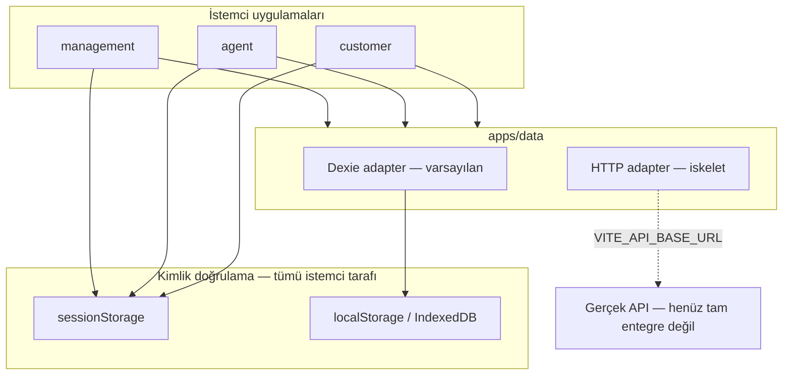

# Apps Güvenlik İncelemesi — Genişletilmiş Rapor

**Kapsam:** `apps/management`, `apps/agent`, `apps/customer`, `apps/data`  
**Tarih:** 18 Haziran 2026  
**Durum:** Mock/Dexie tabanlı **demo geliştirme** — frontend verisi mock; gerçek API yok

Bu belge **uygulama bazlı derin analiz**, **saldırı senaryoları**, **route guard matrisi** ve **demo bağlamında yeniden değerlendirme** içerir. Production aksiyonları en altta referans olarak durur.

**Yapılacaklar (todo):** [apps-demo-todo.md](./apps-demo-todo.md) — üç proje için ayrı checklist.

---

## Yönetici özeti

`apps` monorepo'su dört istemci uygulaması ve paylaşılan veri paketinden oluşuyor. Tümü şu an **istemci tarafında kimlik doğrulama ve yetkilendirme** ile çalışıyor; finansal veri varsayılan olarak **IndexedDB (Dexie)** üzerinde mock olarak tutuluyor.

| Uygulama | Rol | En kritik risk |
|----------|-----|----------------|
| `management` | BackOffice operasyon | `sessionStorage` oturum sahteciliği + parçalı route guard |
| `agent` | Temsilci portalı | OTP yalnızca 6 hane format kontrolü; merkezi yetki yok |
| `customer` | Müşteri self-servis | `epay-customer-authed` bayrağı ile OTP bypass |
| `data` | Paylaşılan veri katmanı | Dexie adapter'da oturum kontrolü yok |

**Sonuç (production):** Mevcut haliyle production ödeme platformu olarak kullanılamaz.

**Sonuç (demo):** Mock auth ve Dexie veri katmanı demo için **kabul edilebilir**; ancak aşağıdaki maddeler demo deneyimini bozan **süreç/UX hataları** veya API'ye geçişte pahalı olacak **tasarım borçlarıdır** — şimdi ele alınmalıdır.

---

## Demo bağlamında değerlendirme

Aşağıdaki tablo, bulguları **demo aşamasında** nasıl yorumlayacağınızı özetler.

| Bulgu | Demo için | Ne zaman düzeltilmeli |
|-------|-----------|------------------------|
| `sessionStorage` oturum, sabit OTP, demo parolalar | ✅ Bilinçli kabul — hızlı test için uygun | API entegrasyonu (Faz: Production) |
| Dexie / mock adapter, IndexedDB'de veri | ✅ Beklenen mimari | API'ye geçerken adapter değişimi |
| `?role=` URL, `alltest` rolü, playground | ✅ Rol testi için faydalı | Production build'den çıkar |
| Açık `/register` + rol seçimi | ⚠️ Demo testine yardımcı ama kafa karıştırıcı | Demo'da kalabilir; UI'da "demo only" etiketi |
| Route guard tutarsızlığı (UI vs URL) | ❌ Rol demo'ları yanıltır | **Şimdi** — demo güvenilirliği |
| `getCurrentUser(role)` ≠ `useAuth().user` | ❌ Onay havuzu demo'su gerçekçi değil | **Şimdi** — süreç doğruluğu |
| `changePassword` / şifre sıfırlama sahte başarı | ❌ Kullanıcıyı yanıltır | **Şimdi** — "demo: kaydedilmez" uyarısı veya mock'ta gerçekten kaydet |
| `pendingTransfer` bellek içi state | ❌ Sekme yenilemede akış kırılır | **Şimdi** — demo stabilitesi |
| Agent OTP herhangi 6 hane | ⚠️ Demo için pratik; ekranda belirtilmeli | API'de gerçek OTP |
| Agent'ta merkezi yetki yok | ⚠️ Tek temsilci demo'su için yeterli | Çoklu temsilci senaryosu öncesi |
| Silent mock fallback (`http` + boş URL) | ❌ Geliştirici hatasını gizler | **Şimdi** — en azından banner/warn |
| Entegrasyon drawer tam payload | ✅ Demo debug için OK | Production'da maskele |
| Parola düz metin mock store'da | ✅ Mock için OK | API'de hash |

### Demo için bilinçli kabul listesi (dokümante edin)

- Uygulamalar yalnızca local / staging'de çalıştırılır; internete açık deploy edilmez.
- `VITE_DATA_DRIVER=dexie` explicit kullanılır.
- Demo kimlik bilgileri gerçek kullanıcı verisi içermez.
- Güvenlik bulguları "çalışmıyor" değil, **henüz implemente edilmedi** olarak yorumlanır.

---

## Mimari genel bakış



### Veri katmanı bootstrap tuzağı (üç uygulamada ortak)

`VITE_DATA_DRIVER=http` seçildiğinde `VITE_API_BASE_URL` yoksa uygulama **sessizce Dexie mock'a düşer**:

| Uygulama | Dosya |
|----------|-------|
| management | `apps/management/src/lib/data-layer.ts` |
| customer | `apps/customer/src/lib/data-layer.ts` |
| agent | Benzer desen (`@epay/data` bootstrap) |

Bu, yanlış deploy'da gerçek API sanılıp demo veriyle çalışma riski taşır. Production'da **fail-fast** (uygulama başlamasın) zorunludur.

---

## Uygulama bazlı derin inceleme

### 1. `management` — BackOffice

#### Kimlik doğrulama akışı

1. `/login` → e-posta/parola (`auth.service.ts` — düz metin karşılaştırma)
2. OTP üretimi istemcide (`Math.random()`), konsola yazılır
3. OTP doğrulama istemcide (`pending.code` ile karşılaştırma)
4. Oturum `sessionStorage['epay-auth-session']` içine `AuthUser` JSON olarak yazılır

**Dosyalar:**

- `apps/management/src/domain/auth-context.tsx`
- `apps/data/src/services/auth.service.ts`
- `apps/data/src/db/seed-auth.ts`

#### Rol çözümleme — tek kaynak ilkesi ihlali

Rol üç kaynaktan gelebilir:

| Kaynak | Ne zaman etkili | Dosya |
|--------|-----------------|-------|
| `auth.user.role` | Oturum açıkken | `auth-context.tsx` |
| `?role=` query param | Oturum yokken (test) | `role-context.tsx` |
| `sessionStorage['epay-backoffice-role']` | Legacy test | `role-context.tsx` |

```ts
// role-context.tsx — oturum yokken URL'den rol
const fromUrl = new URLSearchParams(window.location.search).get('role');
if (isBackOfficeRole(fromUrl)) return fromUrl;
```

Oturum açıkken rol hesaptan gelir; ancak `sessionStorage` manipülasyonu ile `epay-auth-session` içindeki `role` alanı değiştirildiğinde tüm yetki modeli etkilenir.

#### Route guard matrisi

`RequireAuth` yalnızca oturum varlığını kontrol eder (`routes.tsx`). Sayfa düzeyinde izin kontrolü **tutarsız**:

| Kategori | Route guard (`Navigate to="/"`) | Yalnızca UI kısıtı |
|----------|--------------------------------|---------------------|
| Sistem | users, roles, parameters, jobs, notifications, integrations | approval-rules (guard var) |
| Risk | risk/* (çoğu sayfa) | — |
| HR | employees, leave | — |
| Operasyon | ops/accounting, ops/btrans | ops/kyc, ops/reconciliation, ops/fx |
| Finans | — | **wallets**, **transfers**, **banks/***, **approvals** |
| Müşteri/Temsilci | customer-notes, customer-campaigns | **customers**, **customer-fees**, **agents** |
| Destek | support/reports, support/cases (kısmi) | support/cases listesi |
| DMS | document-types form | documents listesi |

**Örnekler:**

- `approvals-page.tsx`: `!permissions.list` → boş state mesajı; route erişilebilir kalır
- `manual-correction-page.tsx`: `!permissions.view` → forbidden mesajı; `/transfers/manual` URL ile açılır
- `customer-fees-page.tsx`: butonlar kısıtlı; `/customers/fees` her oturumlu kullanıcıya açık

#### Onay havuzu — mock kullanıcı kimliği

`getCurrentUser(role)` gerçek oturum kullanıcısını değil, **role'e göre sabit persona** döndürür:

```ts
// current-user.ts
const PERSONAS: Record<BackOfficeRole, CurrentUser> = {
  ops: { id: MOCK_USER_IDS.ops, displayName: 'Ahmet Yılmaz', ... },
  compliance: { id: MOCK_USER_IDS.compliance, ... },
  // ...
};
```

Segregation of duties (maker-checker) UI'da simüle edilir; sunucu tarafı audit trail ve gerçek kullanıcı kimliği bağlantısı yoktur.

#### Entegrasyon logları

- Tablo: `maskPayloadJson` ile maskeleme (`integration-logs.ts`)
- Drawer: `requestFull` / `responseFull` tam JSON (`integration-log-drawer.tsx`)

`management` rolü entegrasyonlara erişebilir; tam payload PCI/PSD2 bağlamında risklidir.

---

### 2. `agent` — Temsilci portalı

#### Kimlik doğrulama

`management` ile aynı `@epay/data` auth servisini kullanır; oturum anahtarı farklı (`APP_SESSION_KEY` — `apps/agent/src/config/app.ts`).

Açık `/register` route'u ve rol seçimi `management` ile aynı riskleri taşır.

#### Yetkilendirme — neredeyse yok

Tüm korumalı route'lar yalnızca `RequireAuth` ile sarılı (`apps/agent/src/routes.tsx`). Modül bazlı `permissions.ts` veya route guard **bulunmuyor**.

UI bileşenlerinde `permissions={{}}` yaygın kullanım:

- `transfer-page.tsx`, `withdrawal-page.tsx`, `customer-search-page.tsx`
- `transaction-history-page.tsx`, `settings-drawer.tsx`
- Dashboard panelleri

Her oturum açmış temsilci tüm işlemlere (transfer, çekim, müşteri kaydı, onay) erişebilir.

#### İşlem onayı — zayıf OTP

```ts
// mock-agent-transactions-adapter.ts
const OTP_PATTERN = /^\d{6}$/;

approve(id, input) {
  if (!OTP_PATTERN.test(input.otp)) return { ok: false, error: 'ag_cf_err_otp' };
  // Herhangi bir 6 haneli kod kabul edilir — sunucu doğrulaması yok
}
```

Güvenlik kontrolleri (`identityChecked`, `photoMatched` vb.) yalnızca checkbox state'i; istemci tarafında zorlanır, bypass edilebilir.

#### Para çekme — limit ve sanction mock

`mock-withdrawal-adapter.ts`:

- Sanction taraması: isimde `"sanction"` geçiyorsa `OnHold`
- Tutar limiti, günlük limit, temsilci yetki limiti **sunucu doğrulaması yok**
- `initiateWithdrawal` doğrudan `agentTransactionsStore`'a yazar

#### Playground route'ları

`management` gibi `/playground/*` production feature flag olmadan açık.

---

### 3. `customer` — Müşteri portalı

#### Kimlik doğrulama katmanları

| Katman | Mekanizma | Bypass |
|--------|-----------|--------|
| Login | `customerPortalApi.login` | Demo parola kaynak kodda |
| OTP | Sabit `123456` / `000000` | Brute-force koruması yok |
| Oturum | `sessionStorage['epay-customer-authed'] === '1'` | Konsoldan `setItem` |

**Dosyalar:**

- `apps/customer/src/app/AuthProvider.tsx`
- `apps/customer/src/features/auth/LoginPage.tsx` (parola varsayılan `DEMO_CUSTOMER_PASSWORD`)
- `apps/data/src/adapters/dexie/customer-portal-dexie.adapter.ts`

#### Korunan route'lar

Tüm uygulama route'ları (`/send/*`, `/settings`, `/activity` vb.) `RequireAuth` altında — ancak auth bayrağı manipüle edilebilir.

#### Sahte süreçler (kullanıcıya yanlış güven)

| İşlem | Davranış | Risk |
|-------|----------|------|
| `changePassword` | `{ ok: true }` döner, parola güncellenmez | Güven yanlışlığı |
| `requestPasswordReset` | Her zaman `{ ok: true }` | E-posta varlığı ifşası + sahte başarı |
| `ForgotPasswordPage` | "Link gönderildi" mesajı | Gerçek e-posta gönderimi yok |

#### Transfer akışı — bellek içi state

```ts
// customer-portal-dexie.adapter.ts
let pendingTransfer: { transactionId, referenceNo, draft } | null = null;
let sessionProfile: CustomerProfile | null = null;
```

| Senaryo | Sonuç |
|---------|-------|
| Sekme yenileme | `pendingTransfer` kaybolur; onay başarısız |
| Çoklu sekme | Son draft öncekini ezer |
| `getProfile` oturumsuz | IndexedDB'den profil döner |
| Transfer OTP | Sabit `123456` / `000000` |
| Bakiye güncelleme | İstemci tarafı; limit kontrolü eksik |

#### İletişim doğrulama

`verifyContact` ve `ContactsSection.tsx`: OTP yine `123456`. Rate-limit yalnızca `resendContactVerification` için; doğrulama denemesi sınırsız.

#### Hassas veri validasyonu (olumlu)

`apps/customer/src/lib/validators.ts` — serbest metin alanlarında TCKN/kart numarası yakalama mevcut. Bu, KVKK/PCI açısından iyi bir UI önlemi; ancak sunucu tarafı validasyonla desteklenmeli.

---

### 4. `data` — Paylaşılan veri paketi

#### Auth servisi (`auth.service.ts`)

- Parolalar düz metin (`acc.password !== password`)
- Kayıtlı hesaplar `sessionStorage['epay-auth-registered']` içinde
- Seed hesaplar kaynak kodda (`seed-auth.ts`)
- Hash yok (bcrypt/argon2)

#### Dexie customer portal adapter

Oturum kontrolü olmayan metodlar (örnekler):

- `getProfile`, `listWallets`, `listTransactions`, `listRecipients`
- `listIbans`, `listFees`, `getSettings`, `listReceipts`, `listContacts`
- `createRecipient`, `updateSettings`, `createSupportCase`

`sessionProfile` yalnızca `verifyOtp` sonrası set edilir; ancak `getProfile` oturum yokken IndexedDB'den döner.

#### HTTP adapter iskeleti

`customer-portal-http.adapter.ts`:

- `credentials: 'include'` (cookie tabanlı oturum varsayımı)
- CSRF token yok
- Retry/idempotency politikası tanımlı değil
- Hata mesajları ham HTTP body içeriyor (bilgi sızıntısı riski)

Production API entegrasyonunda her endpoint için authz + input validation + rate limiting zorunlu.

---

## Saldırı senaryoları (PoC düzeyi)

### Senaryo A — BackOffice yetki yükseltme

1. `/login` ile `ops@epay.demo` / `Epay.1234` ile giriş
2. DevTools → Application → sessionStorage
3. `epay-auth-session` JSON içinde `"role": "management"` yap
4. Sayfayı yenile → management menüleri ve işlemleri erişilebilir

**Etki:** Tam BackOffice yetkisi (mock veri üzerinde).

### Senaryo B — Müşteri OTP atlama

```js
sessionStorage.setItem('epay-customer-authed', '1');
location.href = '/';
```

**Etki:** Transfer, ayarlar, cüzdan görüntüleme (mock).

### Senaryo C — Kendi management hesabı oluşturma

1. `/register` → rol: `management`, parola: `123456`
2. OTP ekranında konsoldaki `[demo OTP]` kodunu gir
3. Hesap `sessionStorage`'da `pending` → `active`

**Etki:** Yetkisiz BackOffice hesabı (mock ortamında).

### Senaryo D — Agent işlem onayı

1. Herhangi bir pending işlem için `/transactions/:id/approve`
2. Checkbox'ları işaretle
3. OTP: `111111` (herhangi 6 hane)

**Etki:** İşlem onaylanır (mock store'da).

### Senaryo E — IndexedDB veri okuma

DevTools → Application → IndexedDB → Dexie tabloları → `customerWallets`, `customerTransactions` düz okunur.

**Etki:** Demo finansal veri ifşası.

---

## OWASP Top 10 — genişletilmiş değerlendirme

| # | Kategori | Durum | Detay |
|---|----------|-------|-------|
| A01 | Broken Access Control | **Kritik** | Client-side authz; route guard eksikleri; agent'ta merkezi yetki yok |
| A02 | Cryptographic Failures | **Kritik** | Düz metin parola; `Math.random()` OTP; sabit müşteri OTP |
| A03 | Injection | **Düşük** | React default escape; özel DSL sınırlı |
| A04 | Insecure Design | **Yüksek** | Mock mimari production desenlerine taşınmış; maker-checker istemcide |
| A05 | Security Misconfiguration | **Yüksek** | Playground açık; demo creds; silent mock fallback; `?role=` hook |
| A06 | Vulnerable Components | **Değerlendirilmedi** | `dependency-auditor` skill ile ayrı tarama önerilir |
| A07 | Auth Failures | **Kritik** | OTP, session, open register, sahte parola sıfırlama |
| A08 | Software/Data Integrity | **Orta** | İstemci tarafı bakiye/transfer state; idempotency kısmi |
| A09 | Logging Failures | **Orta** | Secret'lar log drawer'da; auth event audit yok |
| A10 | SSRF | **Düşük** | HTTP adapter sabit base URL; kullanıcı girdisi yok |

---

## Uyumluluk ve düzenleyici notlar

| Çerçeve | İlgili bulgu | Öncelik |
|---------|--------------|---------|
| **PSD2 / SCA** | OTP istemcide; sabit kod; step-up yok | Kritik |
| **PCI-DSS** | Kart/hesap verisi IndexedDB'de; log'larda tam payload | Yüksek |
| **KVKK** | TCKN mock veride; validators UI'da (iyi) ama sunucu yok | Orta |
| **Maker-checker** | Onay havuzu mock persona; aynı kullanıcı çift onay simüle edilebilir (`alltest`) | Kritik |
| **Audit trail** | İşlem onayları istemci store'da; değiştirilebilir | Kritik |

---

## Tasarımsal borç özeti

1. **İki katmanlı yetki modeli karışık** — `permissions.ts` (modül) + `role-context` + `auth-context` + URL query
2. **Mock persona ≠ gerçek kullanıcı** — Onay havuzu `getCurrentUser(role)` kullanıyor, `useAuth().user` değil
3. **Demo/PROD ayrımı yok** — `import.meta.env.PROD` ile demo UI kapatılmıyor
4. **Paylaşılan auth servisi** — Agent ve management aynı zayıf servisi paylaşıyor
5. **HTTP adapter hazır değil** — Güvenlik kontrolleri API tarafında tasarlanmalı
6. **Agent OTP** — Format kontrolü ≠ doğrulama
7. **Transfer state** — Modül seviyesi değişken; çoklu sekme / yenileme kırılgan

---

## Proje todo listeleri (demo aşaması)

> Güncel ve ayrı dosya: **[apps-demo-todo.md](./apps-demo-todo.md)**

Öncelik etiketleri: **P0** demo akışını kırar / yanıltır · **P1** tasarım borcu · **P2** API'ye geçişte · **P3** production öncesi

Aşağıdaki özet; tam checklist için `apps-demo-todo.md` dosyasına bakın.

### P0 özet

| Proje | Öncelikli maddeler |
|-------|-------------------|
| management | Route guard, rol tek kaynak, onay havuzu ↔ oturum, ForbiddenPage, DemoModeBanner |
| agent | Store persist, `getAgentPermissions()` iskeleti |
| customer | Sahte parola UX, `pendingTransfer` persist, `balanceAfter` |
| ortak | `VITE_DATA_DRIVER` dokümantasyonu |

---

### `management` — BackOffice todo

#### Güvenlik (demo bağlamı)

- [ ] **P0** Route guard tutarlılığı: `wallets`, `transfers`, `approvals`, `customers`, `agents`, `banks/*` için ya `Navigate` guard ya da merkezi `RequirePermission` wrapper
- [ ] **P0** Rol tek kaynak: oturum açıkken `?role=` ve `epay-backoffice-role` devre dışı; test için ayrı `?demoRole=` veya header'da rol switcher
- [ ] **P1** `RequireAuth` yalnızca login kontrolü — demo dokümantasyonuna "rol UI'dan test edilir" notu veya session'daki role ile menü senkronu doğrula
- [ ] **P2** `auth.service.ts` mock parolaları — API contract için `AuthPort` interface'i ayır (implementasyon mock kalsın)
- [ ] **P3** Production: HttpOnly session / JWT, sunucu RBAC, `/register` kapat

#### Tasarımsal / süreç eksiklikleri

- [ ] **P0** Onay havuzu: `getCurrentUser(role)` yerine `useAuth().user.id` + role ile persona eşle; maker-checker demo'su gerçek oturumla uyumlu olsun
- [ ] **P0** `approvals-page`, `manual-correction-page`: yetkisiz erişimde boş mesaj yerine tutarlı `Navigate` veya ortak `ForbiddenPage`
- [ ] **P1** `permissions.ts` modül modül — route seviyesinde merkezi harita (`routePermissions.ts`) oluştur
- [ ] **P1** Entegrasyon log drawer: demo modda bile tablo ile aynı maskeleme (`requestMasked` kullan); tam payload için "geliştirici modu" toggle
- [ ] **P1** `alltest` rolü: UI'da "süper test rolü" badge'i; hangi modülleri bypass ettiği dokümante
- [ ] **P2** Playground route'ları: `import.meta.env.DEV` ile sınırla veya nav'dan gizle (prod build'de zaten tree-shake değil, route kalıyor)

#### Mock veri / stabilite

- [ ] **P0** `data-layer.ts`: `VITE_DATA_DRIVER=http` + boş URL → konsol warn yerine ekranda `DemoModeBanner` ("Mock veri kullanılıyor")
- [ ] **P1** Mock onay işlemleri: approve/reject sonrası store + UI revizyonu tutarlı mı — regression checklist
- [ ] **P2** Seed veri ile management mock'ları (`mocks/*`) senkron — tek seed kaynağı (`@epay/data`)

#### UX / demo sunumu

- [ ] **P1** Login sayfası: demo hesaplar listesi korunsun; "Demo ortamı — gerçek kimlik bilgisi kullanmayın" banner
- [ ] **P1** OTP adımı: demo OTP'yi ekranda göster (zaten konsolda); kullanıcı kopyalayabilsin
- [ ] **P2** Register akışı: "Demo: hesabınız yalnızca bu tarayıcıda" uyarısı

---

### `agent` — Temsilci portalı todo

#### Güvenlik (demo bağlamı)

- [ ] **P1** İşlem onayı OTP: demo için sabit `123456` kabul et VEYA ekranda "herhangi 6 hane" ipucu — şu an davranış belgelenmemiş
- [ ] **P1** `mock-agent-transactions-adapter`: OTP format kontrolü demo için yeterli; production contract'ta `verifyOtp` ayrı port
- [ ] **P2** Temsilci bazlı yetki modeli taslağı: `permissions.ts` + route guard (çoklu temsilci demo'su öncesi)
- [ ] **P3** Production: temsilci limitleri, işlem türü kısıtları sunucuda

#### Tasarımsal / süreç eksiklikleri

- [ ] **P0** `permissions={{}}` yaygın kullanım — en azından sayfa bazlı `getAgentPermissions()` ile buton/route kısıtı (tek temsilci bile olsa UX tutarlılığı)
- [ ] **P1** Onay akışı (`confirmation-page`): checkbox + OTP demo senaryosu dokümante; `alltest` benzeri agent test modu gerekli mi karar ver
- [ ] **P1** Para çekme / transfer: sanction `OnHold` demo'su çalışıyor mu — test senaryoları listesi (`Sanction Test Kişi` vb.)
- [ ] **P1** `DEMO_AGENT_ID` sabit — çoklu agent demo'su için seed genişletme planı
- [ ] **P2** Playground route'ları: management ile aynı DEV-only politikası

#### Mock veri / stabilite

- [ ] **P0** `agentTransactionsStore`: sayfa yenileme sonrası pending işlemler persist mi (IndexedDB / sessionStorage) — yoksa demo akışı kırılır
- [ ] **P1** Çekim duplicate reference kontrolü (`isDuplicateReference`) — demo'da çift tıklama senaryosu test et
- [ ] **P1** İşlem geçmişi + onay detayı: `ACTIVITY_BY_TX_ID` fallback tutarlılığı
- [ ] **P2** `data-layer` bootstrap: management ile aynı mock banner

#### UX / demo sunumu

- [ ] **P1** Login: demo hesap + parola ipucu (management ile tutarlı)
- [ ] **P1** Transfer / çekim formları: limit aşımı, blocked müşteri, düşük KYC uyarıları görünür mü — demo script
- [ ] **P2** Makbuz / imzalı dekont akışı: print ve upload demo'su uçtan uca checklist

---

### `customer` — Müşteri portalı todo

#### Güvenlik (demo bağlamı)

- [ ] **P1** `epay-customer-authed` bayrağı: demo için kabul; login sayfasına "geliştirici modu" notu — production'da API session
- [ ] **P1** Sabit OTP `123456` / `000000`: login ve transfer'de tutarlı ipucu göster (`LoginPage` kısmen var)
- [ ] **P2** `validators.ts` TCKN/kart yakalama — iyi uygulama; diğer serbest metin alanlarına genişlet
- [ ] **P3** Production: OTP, session, parola hash sunucuda

#### Tasarımsal / süreç eksiklikleri

- [ ] **P0** `changePassword`: ya mock store'da gerçekten güncelle ya da UI'da kalıcı "Demo: parola kaydedilmez" uyarısı — **sahte başarı kaldırılmalı**
- [ ] **P0** `requestPasswordReset` / `ForgotPasswordPage`: "demo modunda e-posta gönderilmez" mesajı; yanıltıcı başarı metnini düzelt
- [ ] **P0** `pendingTransfer` modül state: Dexie'de `pendingTransfers` tablosu veya `sessionStorage` ile persist — sekme yenilemede onay akışı kırılmasın
- [ ] **P1** `getProfile` oturumsuz IndexedDB dönüşü: demo adapter'da `sessionProfile` yoksa null dön (auth akışını zorla)
- [ ] **P1** İletişim doğrulama OTP sabit — `ContactsSection` demo ipucu
- [ ] **P1** Transfer limitleri: mock'ta `internetDailyLimit` kontrolü ekle veya UI'da "limit kontrolü demo'da kapalı" etiketi
- [ ] **P2** Çoklu sekme: aynı anda iki transfer draft — son yazılan kazanır; uyarı veya kilitleme

#### Mock veri / stabilite

- [ ] **P0** `customer-portal-dexie.adapter`: `approveTransfer` sonrası `balanceAfter` hesaplama (şu an `0` sabit) — demo veri tutarlılığı
- [ ] **P1** FX quote TTL (90 sn): süre dolunca UI yenileme davranışı
- [ ] **P1** `data-layer.ts`: mock mode banner (management ile ortak bileşen)
- [ ] **P2** Recipient CRUD + transfer "kaydet" akışı: seed ile senkron

#### UX / demo sunumu

- [ ] **P1** Login: varsayılan dolu parola demo için OK; production build'de boş başlat (`import.meta.env.PROD`)
- [ ] **P1** OTP ekranında "Demo OTP: 123456" butonu (mevcut `onClick` korunsun, metin netleştir)
- [ ] **P2** Ayarlar sayfası: `DEMO_CUSTOMER_PASSWORD` ipucu — demo/staging etiketi
- [ ] **P2** Şikayet / destek case oluşturma: mock'ta listeye düşüyor mu uçtan uca test

---

### Ortak (`apps/data` + üç uygulama)

- [ ] **P0** `VITE_DATA_DRIVER` env dokümantasyonu: README'de `dexie` vs `http` tablosu
- [ ] **P1** Mock / HTTP adapter aynı `*Api` contract — geçişte tek satır config değişimi
- [ ] **P1** `auth.service.ts` ve customer portal adapter: demo mod flag (`isDemoMode()`) ile sahte başarı davranışlarını merkezileştir
- [ ] **P2** Seed veriler: gerçek TCKN/IBAN yerine açıkça fake prefix (`999…`) — KVKK demo hijyeni
- [ ] **P3** HTTP adapter: CSRF, retry, idempotency — API geldiğinde

---

## Öncelikli aksiyon planı (production — referans)

> Demo aşamasında aşağıdaki maddeler **ertelenir**. API entegrasyonu başlamadan önce bu listeye dönün.

### Faz 0 — Hemen (production bloklayıcı)

- [ ] Tüm auth/OTP/parola işlemlerini backend API'ye taşı
- [ ] HttpOnly session cookie veya kısa ömürlü JWT (+ refresh rotation)
- [ ] Her API endpoint'inde sunucu tarafı rol/izin kontrolü
- [ ] `/register` kapat veya admin invite + e-posta doğrulama
- [ ] Rol atamasını kullanıcıdan alma; RBAC sunucuda
- [ ] `VITE_DATA_DRIVER=http` + boş API URL → uygulama başlamasın (fail-fast)
- [ ] Demo OTP/parola/hesap UI → `import.meta.env.PROD` ile gizle
- [ ] Playground ve `?role=` test hook'larını production build'den çıkar
- [ ] `alltest` rolünü production'dan kaldır

### Faz 1 — Kısa vade (1–2 sprint)

- [ ] Merkezi `RequirePermission(permission)` route wrapper — tüm management route'ları
- [ ] Agent uygulamasına modül bazlı yetki modeli (temsilci limitleri, işlem türleri)
- [ ] OTP: `crypto.getRandomValues`, TTL (ör. 5 dk), max 3 deneme, sunucu doğrulama
- [ ] Parola: argon2id/bcrypt, min 12 karakter, karmaşıklık, breach list kontrolü
- [ ] `changePassword` / `requestPasswordReset` gerçek implementasyon
- [ ] Entegrasyon log drawer: secret alanları maskele; tam payload rol bazlı kısıt
- [ ] CSRF token (cookie auth kullanılıyorsa)
- [ ] Login redirect: `location.state.from` için allowlist (open redirect önleme)
- [ ] Onay havuzu: gerçek `userId` + sunucu audit log

### Faz 2 — Orta vade

- [ ] IndexedDB'de hassas veri şifreleme veya mock veriyi production'dan tamamen ayır
- [ ] Transfer/idempotency: sunucu tarafı `idempotencyKey` zorunlu
- [ ] Rate limiting: login, OTP, transfer, API genel
- [ ] Security headers (CSP, HSTS, X-Frame-Options)
- [ ] Auth event logging (login, logout, failed OTP, role change)
- [ ] Dependency CVE taraması CI'ya ekle
- [ ] Penetrasyon testi (OWASP ASVS L2 hedef)

### Faz 3 — Demo ortamı kabul kriterleri

Demo/staging için dokümante edilmesi gerekenler:

- Ağ izolasyonu (VPN / IP allowlist)
- Demo kimlik bilgileri rotation
- Mock veri production verisiyle karışmamalı
- `VITE_DATA_DRIVER=dexie` explicit olarak set edilmeli
- Güvenlik incelemesi yenileme periyodu (ör. her major release)

---

## Test önerileri

| Test | Araç / yöntem | Beklenen (production) |
|------|---------------|------------------------|
| Oturum manipülasyonu | DevTools sessionStorage | Reddedilmeli / sunucu 401 |
| OTP brute-force | 1000 deneme script | Rate limit + lockout |
| Yetkisiz route erişimi | Her rol × her URL matrisi | 403 veya redirect |
| Open redirect | `state.from=https://evil.com` | Allowlist reddi |
| CSRF | Cross-origin POST (cookie auth) | Token doğrulama |
| IDOR | Başka kullanıcı `walletId` / `transactionId` | 403 |
| Mock fallback | `http` driver + boş URL | Uygulama başlamaz |

---

## İlgili dosyalar (genişletilmiş indeks)

| Konu | Dosya |
|------|-------|
| BackOffice auth | `apps/management/src/domain/auth-context.tsx` |
| Agent auth | `apps/agent/src/domain/auth-context.tsx` |
| Customer auth | `apps/customer/src/app/AuthProvider.tsx` |
| Rol context | `apps/management/src/domain/role-context.tsx` |
| Auth service | `apps/data/src/services/auth.service.ts` |
| Demo seed (BackOffice) | `apps/data/src/db/seed-auth.ts` |
| Demo seed (müşteri) | `apps/data/src/db/seed-customer-portal.ts` |
| Customer portal adapter | `apps/data/src/adapters/dexie/customer-portal-dexie.adapter.ts` |
| Customer HTTP adapter | `apps/data/src/adapters/http/customer-portal-http.adapter.ts` |
| Management data layer | `apps/management/src/lib/data-layer.ts` |
| Customer data layer | `apps/customer/src/lib/data-layer.ts` |
| Management routes | `apps/management/src/routes.tsx` |
| Agent routes | `apps/agent/src/routes.tsx` |
| Customer routes | `apps/customer/src/routes.tsx` |
| Kayıt sayfası | `apps/management/src/features/auth/register-page.tsx` |
| Onay havuzu permissions | `apps/management/src/features/approval-pool/domain/permissions.ts` |
| Mock current user | `apps/management/src/features/approval-pool/domain/current-user.ts` |
| Agent işlem onayı | `apps/agent/src/features/transaction-confirmation/api/mock-agent-transactions-adapter.ts` |
| Agent para çekme | `apps/agent/src/features/withdrawal/api/mock-withdrawal-adapter.ts` |
| Entegrasyon log drawer | `apps/management/src/features/system/integrations/components/integration-log-drawer.tsx` |
| Entegrasyon log seed | `apps/management/src/mocks/integration-logs.ts` |
| Müşteri validators | `apps/customer/src/lib/validators.ts` |
| Parolamı unuttum | `apps/customer/src/features/auth/ForgotPasswordPage.tsx` |

---

## Sonuç

### Demo aşaması (şu an)

Mock auth ve Dexie **doğru tercih**; aşağıdakiler demo kalitesini düşürüyor ve **şimdi** ele alınmalı:

1. **Route guard tutarsızlığı** (`management`) — rol demo'ları güvenilmez
2. **Onay havuzu mock persona** — oturum kullanıcısı ile uyumsuz
3. **`pendingTransfer` bellek state** (`customer`) — transfer demo'su kırılgan
4. **Sahte başarı süreçleri** — parola değiştir / sıfırla yanıltıcı
5. **Silent mock fallback** — geliştirici hatasını gizler

Güvenlik bulgularının çoğu (sessionStorage, sabit OTP, düz metin parola) demo için **bilinçli kabul**; internete açık deploy edilmemeli.

### Production geçişi

Backend authn/authz tamamlanmadan production **başlatılmamalıdır**. Ayrıntılar § Öncelikli aksiyon planı (production) bölümünde.

Yapılacaklar: **[apps-demo-todo.md](./apps-demo-todo.md)** — `management`, `agent`, `customer` ayrı listeler.
