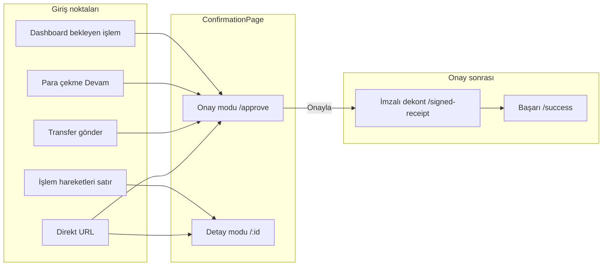

# İşlem Onay / Detay — Demo Senaryoları

## Amaç

`ConfirmationPage` ve bağlı ekranların (imzalı dekont, başarı) demo sunumu ve manuel testi. Ürün spesifikasyonu: [`docs/Agent/1.1.islem-onay.md`](../../../docs/Agent/1.1.islem-onay.md).

**Bileşen:** `apps/agent/src/features/transaction-confirmation/confirmation-page.tsx`

## Ön koşullar

- [ ] Agent dev server: `http://localhost:5176` (`pnpm --filter @epay/agent dev`)
- [ ] Giriş: demo temsilci hesabı (işlem yetkili profil)
- [ ] Mock sürücü: `VITE_DATA_DRIVER=dexie` (varsayılan) — OTP ipucu banner görünür
- [ ] Seed: `agentTransactionsStore` — `sessionStorage` (`epay-agent-tx-store:{agentId}`); sekme içi yenilemede onaylar korunur

## Akış özeti

## Route ve mod

| Route | Bileşen | İzin anahtarı | Mod |
|-------|---------|---------------|-----|
| `/transactions/:id` | `ConfirmationPage` | `transactions.view` | **Detay** (salt okunur güvenlik) |
| `/transactions/:id/approve` | `ConfirmationPage requestApprove` | `transactions.approve` | **Onay** yalnızca `status=Pending` |
| `/transactions/:id/signed-receipt` | `SignedReceiptPage` | `transactions.approve` | Onay sonrası |
| `/transactions/:id/success` | `TransactionSuccessPage` | `transactions.approve` | Dekont yüklendikten sonra |
| `/receipt/:id` | `ReceiptPrintPage` | auth | Yazdırma (yeni sekme) |

**Mod kuralı** (`confirmation-mode.ts`): `requestApprove=true` **ve** işlem `Pending` → Onay modu. Aksi halde Detay modu (`OnHold`, `Completed`, listeden açılış vb.).

## Demo OTP (mock)

| Ortam | Davranış |
|-------|----------|
| Mock (`dexie`) | `123456` önerilir; **herhangi 6 rakam** kabul edilir |
| HTTP (`VITE_DATA_DRIVER=http`) | `POST /agent/transactions/:id/verify-otp` — sunucu doğrular |
| UI ipucu | Onay modunda sarı banner: **Kodu doldur** → OTP alanına `123456` yazar |

Port: `contracts/agent-transaction-approval-otp-port.ts` · Mock: `mock-agent-transaction-approval-otp.adapter.ts`

## Güvenlik paneli (onay modu)

Tümü işaretlenmeden onay tamamlanmaz:

| Checkbox | Ne zaman |
|----------|----------|
| Kimlik kontrol edildi | Her zaman |
| Fotoğraf eşleşti | Her zaman |
| Yetki kontrol edildi | Gönderen/alıcı tüzel ise (`requiresAuthority`) |
| Şüpheli davranış yok | Her zaman |

**Kritik risk / beyan:** `InternationalTransfer` **veya** tutar ≥ 50.000 TRY → Onayla sonrası **İşlem Beyanı** modalı. `Other` / `Unknown` nedeninde not zorunlu.

## Test verisi (seed işlemler)

| ID | TX No | Tür | Tutar | Durum | Demo senaryosu |
|----|-------|-----|-------|-------|----------------|
| 90001 | TX-AG-90001 | Para çekme | 8.500 TRY | Pending | **A** — standart onay (Caner Avcı → temsilci) |
| 90002 | TX-AG-90002 | Banka transferi | 12.000 TRY | Pending | **B** — banka havalesi onayı (Hatice Acar) |
| 90003 | TX-AG-90003 | Yurt dışı | 62.000 TRY | Pending | **C** — kritik + beyan modalı (tüzel müşteri) |
| 90004 | TX-AG-90004 | Kişiye transfer | 3.200 TRY | OnHold | **D** — detay modu (onay butonu yok) |
| 90005 | TX-AG-90005 | Kişiye transfer | 5.000 TRY | Completed | **E** — dekont indir (seed'de imzalı PDF var) |
| 90006 | TX-AG-90006 | Para çekme | 1.200 USD | Completed | Detay + dekont (döviz) |

OnHold (90004) bekleyen işlemler panelinde **listelenmez** — yalnızca `Pending` satırları dashboard'da görünür.

---

## Demo senaryoları (sunum scripti)

### Senaryo A — Standart onay (5 dk)

**Hedef:** Para çekme → OTP → imzalı dekont → başarı.

| Adım | Aksiyon | Beklenen |
|------|---------|----------|
| 1 | `/` → Bekleyen İşlemler → `TX-AG-90001` satırı | `/transactions/90001/approve` |
| 2 | Başlık **İşlem Onay**; Onayla / Düzenle / İptal görünür | Onay modu |
| 3 | Güvenlik: OTP boş, checkbox'lar boş → **Onayla** | Hata toast (`ag_cf_err_checks` veya OTP) |
| 4 | Sarı demo banner → **Kodu doldur** | OTP `123456` dolu |
| 5 | Dört checkbox işaretle → **Onayla** | `ag_cf_approved` toast |
| 6 | Yönlendirme | `/transactions/90001/signed-receipt` |
| 7 | **Dekont yazdır** (önizleme) + PDF/JPG seç (≤5 MB) → yükle | `/transactions/90001/success` |
| 8 | Başarı ekranı | Ana sayfa / dekont indir linkleri |

**Alternatif giriş:** [Para çekme](withdrawal.md) → Caner Avcı sorgula → form doldur → Devam → aynı onay URL'si (`?mode=confirm&from=withdrawal`).

---

### Senaryo B — Banka transferi onayı

| Adım | Aksiyon | Beklenen |
|------|---------|----------|
| 1 | `/transactions/90002/approve` | IBAN alıcı panelinde; gönderen Hatice Acar |
| 2 | OTP + checkbox → Onayla | Onay → imzalı dekont |
| 3 | Dashboard'a dön | Bekleyen işlem sayısı 3→2 |

**Alternatif giriş:** Transfer → banka hesabı → gönderen sorgula → gönder → onay ekranı.

---

### Senaryo C — Kritik işlem + İşlem Beyanı

| Adım | Aksiyon | Beklenen |
|------|---------|----------|
| 1 | `/transactions/90003/approve` | FX alanları (EUR, kur, hedef tutar) görünür |
| 2 | OTP + checkbox tam → **Onayla** | **İşlem Beyanı** modalı açılır (kritik risk) |
| 3 | Yakınlık + neden seç → Onayla | Modal kapanır, onay tamamlanır |
| 4 | Neden = **Diğer** veya **Bilinmiyor**, not boş | `ag_cf_err_declaration_note` |
| 5 | İmzalı dekont adımları | Senaryo A adım 6–8 ile aynı |

Kritik tetikleyici (`confirmation-mode.ts`): `InternationalTransfer` veya `principalAmount >= 50_000`.

---

### Senaryo D — Detay modu (OnHold / tamamlanmış)

| Adım | Aksiyon | Beklenen |
|------|---------|----------|
| 1 | `/transactions/90004` | Başlık **İşlem Detay**; Onayla/İptal yok |
| 2 | Güvenlik paneli | OTP ve checkbox **disabled** |
| 3 | `/transactions/90005` | **Dekont İndir** aktif → `/receipt/90005` yazdırma |
| 4 | `/transactions/90005/approve` | Hâlâ **Detay** (Pending değil) — onay modu açılmaz |

---

### Senaryo E — İptal

| Adım | Aksiyon | Beklenen |
|------|---------|----------|
| 1 | `/transactions/90002/approve` | Onay ekranı |
| 2 | **İptal Et** | `ag_cf_cancelled` toast → `/` |
| 3 | İşlem durumu | `Canceled` — dashboard bekleyen listeden düşer |

---

### Senaryo F — Yetkisiz profil (salt okunur)

**Hedef:** Route guard + sayfa içi buton kısıtı (P0 permissions).

| Adım | Aksiyon | Beklenen |
|------|---------|----------|
| 1 | Çıkış → giriş URL'sine `?agentDemo=readonly` ekle veya `finance` rolü ile giriş | `canTransact=false` |
| 2 | `/transactions/90001/approve` | **Forbidden** veya onay butonları gizli |
| 3 | `/transactions/90001` | Detay görüntülenebilir (`transactions.view`) |

Profil: `domain/agent-session.ts` · UI: `useAgentUiPermissions().flags.canApproveTransaction`

---

### Senaryo G — Uçtan uca (yeni işlem)

Dashboard seed yerine canlı mock akış:

1. [Para çekme](withdrawal.md) veya transfer formu → **Devam**
2. Onay ekranı (`?from=withdrawal` / `from=transfer`)
3. Onay → imzalı dekont → başarı
4. **İşlem Hareketleri** (`/transactions`) → yeni satır → detay drawer

Yeni işlem ID'si `agentTransactionsStore.addRecord` ile `95000+` aralığında üretilir.

---

## Hata matrisi (mock)

| Koşul | Toast anahtarı |
|-------|----------------|
| OTP ≠ 6 hane | `ag_cf_err_otp` |
| Checkbox eksik | `ag_cf_err_checks` |
| Pending değil | `ag_cf_err_state` |
| Beyan eksik | `ag_cf_err_declaration` |
| Beyan notu eksik (Other/Unknown) | `ag_cf_err_declaration_note` |
| İşlem yok | `ag_cf_err_not_found` / `frp_tx_not_found` |

## Checklist (demo öncesi)

- [ ] Dev server ayakta, giriş yapılmış
- [ ] OTP demo banner görünüyor (mock mod)
- [ ] Senaryo A: 90001 uçtan uca
- [ ] Senaryo C: 90003 beyan modalı
- [ ] Senaryo D: 90004 detay / 90005 dekont
- [ ] Senaryo F: readonly profilde onay kapalı
- [ ] Sayfa yenileme sonrası onay/iptal durumunun korunduğu biliniyor (`sessionStorage`)

## Bilinen sınırlamalar (demo)

| Konu | Not |
|------|-----|
| Store persist | `agent-transactions-store-persist.ts` — `sessionStorage` v1 |
| OTP | Mock'ta sunucu challenge yok; production'da ayrı port |
| Güvenlik checkbox | İstemci state — bypass edilebilir; production'da API zorunlu |
| ACTIVITY_BY_TX_ID | `resolve-agent-transaction.ts` — store öncelikli; activity fallback salt okunur (`storeBacked: false`) |

## İlgili kod

| Konu | Dosya |
|------|-------|
| Sayfa | `confirmation-page.tsx` |
| Hook | `hooks/use-confirmation.ts` |
| Mod | `domain/confirmation-mode.ts` |
| OTP demo | `domain/demo-approval-otp.ts`, `components/approval-otp-demo-hint.tsx` |
| Resolver | `domain/resolve-agent-transaction.ts` |
| Onay API | `api/mock-agent-transactions-adapter.ts` (`approve`) |
| Seed | `api/agent-transactions-store.ts` |
| Route guard | `domain/route-permissions-map.ts` (`transactions.approve`) |
| UI izinleri | `domain/ui-permissions.ts` |
| İmzalı dekont | `signed-receipt-page.tsx` |
| Dekont yazdır | `features/receipt/receipt-print-page.tsx` |

## Çapraz referanslar

- [Ana sayfa — bekleyen işlemler](dashboard.md)
- [Para çekme → onay girişi](withdrawal.md)
- [Müşteri kaydı — pending transfer kilidi](customer-registration.md)
